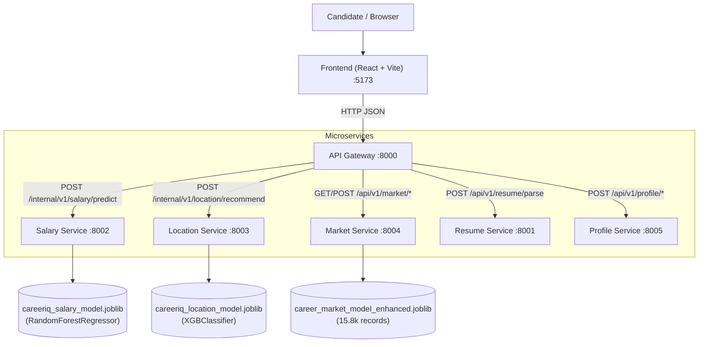

# CareerIQ — System Architecture Documentation

## 1. Overview
CareerIQ is a microservice-based decision intelligence platform for tech professionals and students. It evaluates resumes, predicts realistic salary bands, ranks optimal work locations, and identifies critical skill gaps using real, trained ML models.

## 2. Microservice Topology

| Service | Port | Primary Responsibility | Backed By |
|---|---|---|---|
| **API Gateway** | `8000` | Single public backend entry point, request validation, and multi-service orchestration | FastAPI, Async HTTPX |
| **Resume Service** | `8001` | PDF, DOCX, and TXT parsing into structured candidate profiles | PyMuPDF, python-docx |
| **Salary Service** | `8002` | Annual salary prediction (Lakhs INR) | `careeriq_salary_model.joblib` |
| **Location Service** | `8003` | Ranking 55 employment locations based on skill vector and experience | `careeriq_location_model.joblib` |
| **Market Service** | `8004` | Market demand analytics, role stats, and empirical skill-gap analysis | `career_market_model_enhanced.joblib` |
| **Profile Service** | `8005` | Candidate profile persistence | SQLite |
| **Frontend** | `5173` | Interactive career intelligence dashboard | React, TypeScript, Tailwind |

## 3. Strict Boundary Rules
1. **Frontend Isolation:** The frontend communicates strictly with the API Gateway (`port 8000`). It never touches microservices directly and never loads Python code or `.joblib` files.
2. **Model Exclusivity:** Models are loaded into memory once on service startup by their respective owner microservice.
3. **Zero Third-Party AI APIs:** All decisions, predictions, and recommendations are generated strictly by the trained ML models and datasets.
